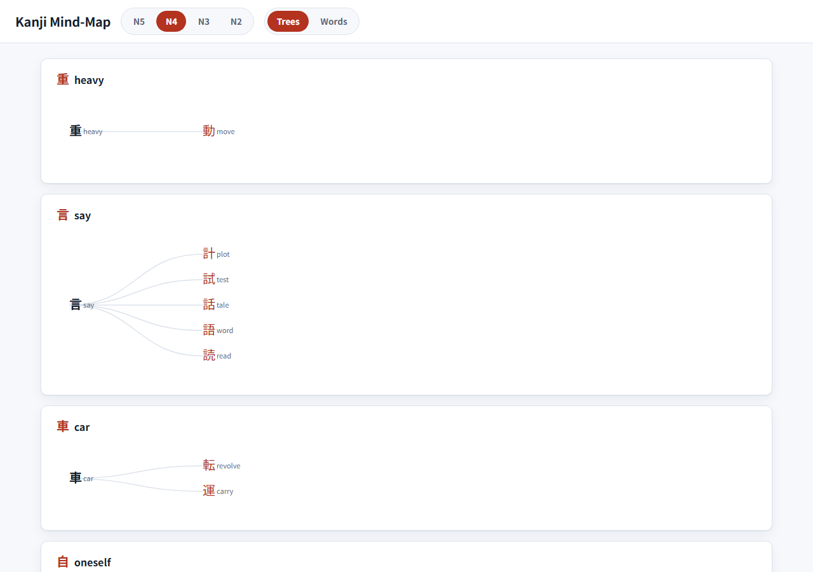

# Kanji Mind-Map (JLPT N5–N2)

Interactive kanji mind-maps organized by JLPT level, showing on'yomi and kun'yomi
readings with heuristic sample vocabulary.  The same data is rendered as a
printable PDF for each level.



---

## What it does

- **Web app** (static, no build step) — browse N5, N4, N3, and N2 kanji arranged
  into "built-from" mind-map trees, where each kanji branches off the simpler
  kanji it is structurally composed of (e.g. 一 → 元 → 院, 十 → 土 → 主 → 注).
  Click any kanji node — including the root building-block — to open a detail
  panel showing stroke count, meanings, on'yomi/kun'yomi readings, example words
  for each reading, and a **"Words using this kanji"** cross-link list of
  compound words whose every kanji appears at or below the current level.
- **Words view** (new in v2) — a gallery of compound words (sourced from JMdict)
  whose every kanji you have learned up to and including the selected level
  (cumulative known-set), capped at 250 words per level.  Words are sorted by
  kanji-count descending then by length.  Clicking a kanji chip in a word card
  opens that kanji's detail panel.
- **Navigation** — a level selector (N5 N4 N3 N2) and a Trees | Words view
  toggle let you switch context without reloading.
- **Print / PDF** — `print.html?level=N5` (or `N4`, `N3`, `N2`) renders all
  trees plus a reference table and a words-reference table suitable for printing
  or exporting to PDF.  PDFs (`kanji-N5.pdf` through `kanji-N2.pdf`) are built
  in CI and downloadable as an artifact from the Actions tab, or generated
  locally (see below).
- **Offline-first** — all data is bundled in `data/n5.json` … `data/n2.json`
  (no runtime network calls from the browser).
- **Mobile / responsive** — below 700 px the detail panel becomes a bottom
  sheet, the words grid collapses to a single column, and mind-map cluster cards
  scroll horizontally.

---

## Data counts

| Level | Kanji in JSON | Clusters | Words (capped) |
|-------|--------------|----------|----------------|
| N5    | 79           | 10       | 250            |
| N4    | 228          | 31       | 250            |
| N3    | 585          | 53       | 250            |
| N2    | 877          | 66       | 250            |

N4 kanji count includes the N5 building-block kanji that connect N4 kanji into
chains; similarly for N3 and N2.

---

## Connection model: structural "built-from" trees

Every edge in the mind-map is a real **"is built from"** relationship, computed
from Ideographic Description Sequences (IDS) by `scripts/trees_ids.py`:

- A kanji's **parent** is the most specific *in-scope* kanji that appears in its
  structural decomposition.  So 字 hangs off **子** (字 = ⿱宀子), never off an
  unrelated component, and chains deepen naturally: 一 → 元 → 院, 十 → 土 → 主 → 注.
- **Roots** are real kanji building-blocks (一, 月, 言, 車 …) with no in-scope
  parent; they are clickable like any other node.
- Each level view uses the **cumulative** kanji set (N5 ∪ … ∪ this level) as
  the parent-search scope, so lower-level kanji can connect higher-level kanji
  into longer chains.  Only trees that contain at least one kanji from the
  current level are shown.
- Kanji with no in-scope parent *and* no children are collected into a single
  **"Other (standalone)"** cluster.
- **Radical-variant unification** — a `VARIANT_TO_KANJI` map in
  `scripts/trees_ids.py` normalises orthographic variants before IDS lookup
  (e.g. the food radical 飠 → 食), so kanji like 飯, 飲, and 館 correctly nest
  under 食 rather than appearing as orphans.

This replaced an earlier approach (hand-transcribed trees + Kangxi-radical
grouping) that produced wrong edges (e.g. 字 grouped under 月) and shallow,
disconnected chains.

> **On/kun vocabulary note:** Example words are selected heuristically from
> JMdict — on'yomi examples are matched by a reading-substring of the
> on-yomi; kun'yomi examples are matched by a reading-prefix of the full kun
> reading (excluding on-reading words).  The selection is example-quality and
> is not exhaustive.  The Words view words are likewise heuristic
> example-quality and are not a curated word list.

---

## Local development

### Prerequisites

- Python 3.10+ (commands shown use `python`; substitute `python3` on macOS/Linux)
- Node.js 18+
- Git

### 1 — Install dependencies

```bash
python -m venv .venv
# Windows
.venv\Scripts\pip install -r requirements.txt
# macOS / Linux
.venv/bin/pip install -r requirements.txt

# Install Playwright browser (only needed for PDF generation)
python -m playwright install chromium
```

### 2 — Download raw sources (one-time)

```bash
python -m scripts.fetch_sources
```

This downloads KANJIDIC2, JMdict, the JLPT level list, and the IDS
decomposition file into `raw/` (gitignored).

### 3 — Build data files

```bash
python -m scripts.build_data
```

Writes `data/n5.json`, `data/n4.json`, `data/n3.json`, and `data/n2.json`.

> **Important:** always run pipeline scripts as modules (`python -m scripts.build_data`,
> not `python scripts/build_data.py`) from the repo root — they use
> package-relative imports.

### 4 — Serve the web app

```bash
npm run serve
```

Then open http://localhost:8000.

### 5 — Generate PDFs locally

```bash
python -m pdf.generate_pdf
```

Writes `pdf/kanji-N5.pdf` through `pdf/kanji-N2.pdf`.

---

## Running tests

```bash
# JavaScript (Node built-in runner, 12 tests)
npm test

# Python (pytest, 23 tests)
python -m pytest
```

---

## How to add N1 later

The schema and code already treat level as a parameter; adding N1 requires
three small steps:

1. **Data** — in `scripts/build_data.py`, add `"N1"` to the `LEVEL_ORDER` list
   and supply its character set in `_jlpt_chars`.  The `main()` loop already
   iterates `LEVEL_ORDER` and builds each level's cumulative known-set
   automatically, so N1 will be built with scope = N5 ∪ N4 ∪ N3 ∪ N2 ∪ N1 and
   the words index will use the same cumulative set with the 250-word cap.  No
   new tree module is needed — the IDS builder works for every level.
2. **Navigation** — add a `<button data-level="N1">N1</button>` to the `#levels`
   nav in `index.html` and a matching entry in `print.html`.
3. **PDF CI** — add `N1` to the level list in `.github/workflows/pdf.yml`.

No structural changes to `js/` or `css/` are needed.

---

## Deployment

The app is deployed to **GitHub Pages** from the `main` branch via
`.github/workflows/pages.yml`.  Push to `main` to trigger a new deployment.

PDF artifacts are built by `.github/workflows/pdf.yml` on every push and
can be downloaded from the Actions tab.

---

## Attribution

| Asset | Source | Licence |
|-------|--------|---------|
| Kanji readings & meanings | KANJIDIC2, © The Electronic Dictionary Research and Development Group (EDRDG) | CC BY-SA 4.0 |
| Vocabulary examples | JMdict, © EDRDG | CC BY-SA 4.0 |
| JLPT level lists | [davidluzgouveia/kanji-data](https://github.com/davidluzgouveia/kanji-data) (pinned commit SHA in `scripts/sources.py`) | MIT |
| Kanji structural decomposition (IDS) | [cjkvi-ids](https://github.com/cjkvi/cjkvi-ids), based on the CHISE IDS database (pinned commit SHA in `scripts/sources.py`) | GPLv2 |
| Japanese font | Noto Sans JP, © Google | SIL Open Font Licence 1.1 (OFL) |

> The IDS data (GPLv2) is used only at **build time** to compute factual
> "kanji-X-is-built-from-kanji-Y" relationships; the source file is never
> committed or redistributed.  The generated `data/*.json` contains those
> derived facts together with the EDRDG-derived readings/vocabulary and is
> distributed under **CC BY-SA 4.0**.

The generated files `data/n5.json` through `data/n2.json` are derivative works
of KANJIDIC2 and JMdict and are therefore distributed under **CC BY-SA 4.0**.

> **Words quality note:** compound words in the Words view and "words using this
> kanji" cross-links are selected heuristically from JMdict and are
> example-quality — they are not a curated or exhaustive vocabulary list.
